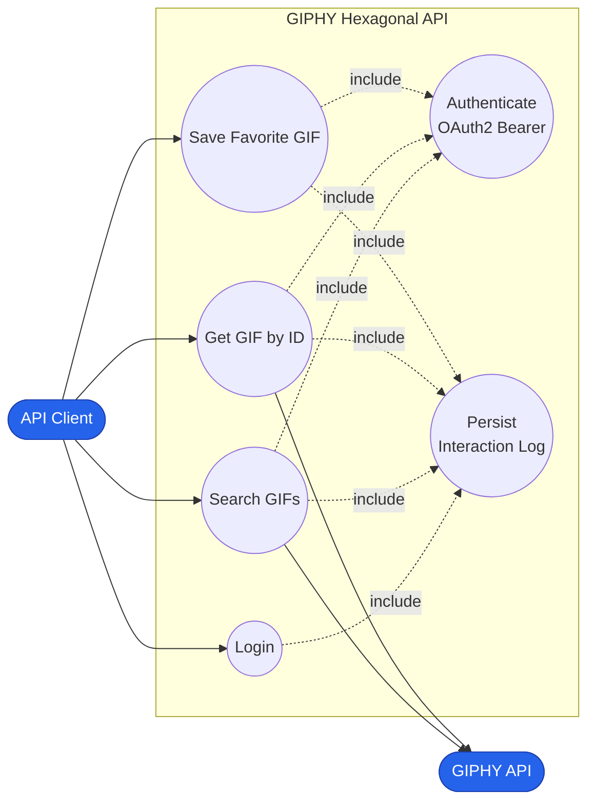
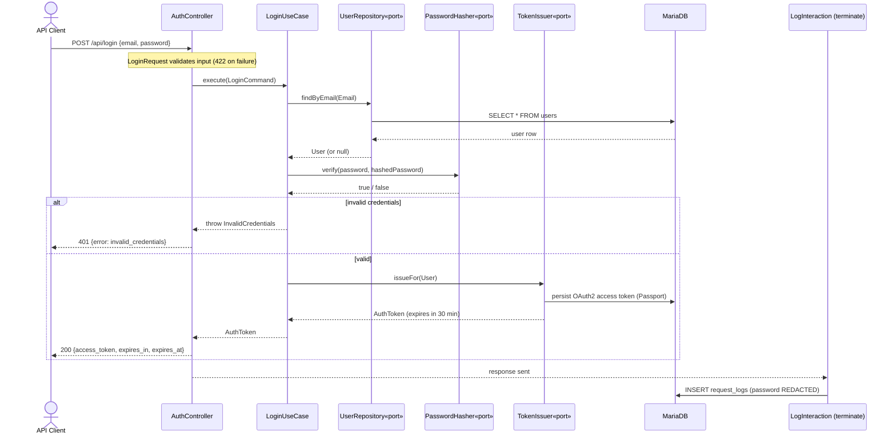
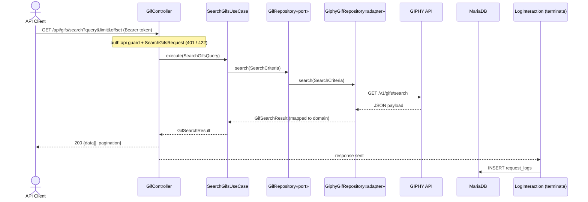
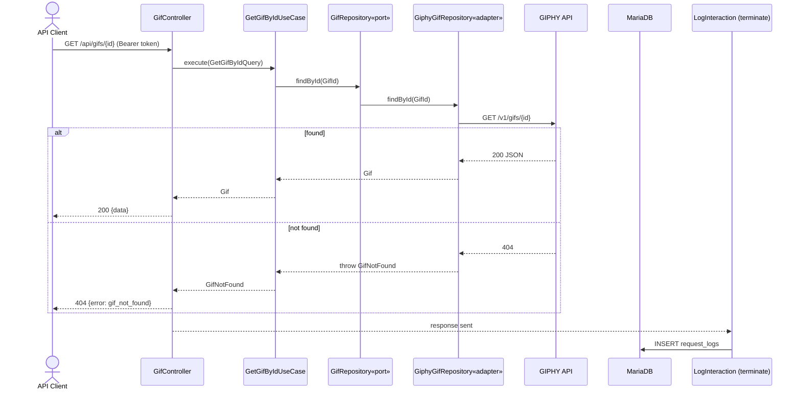
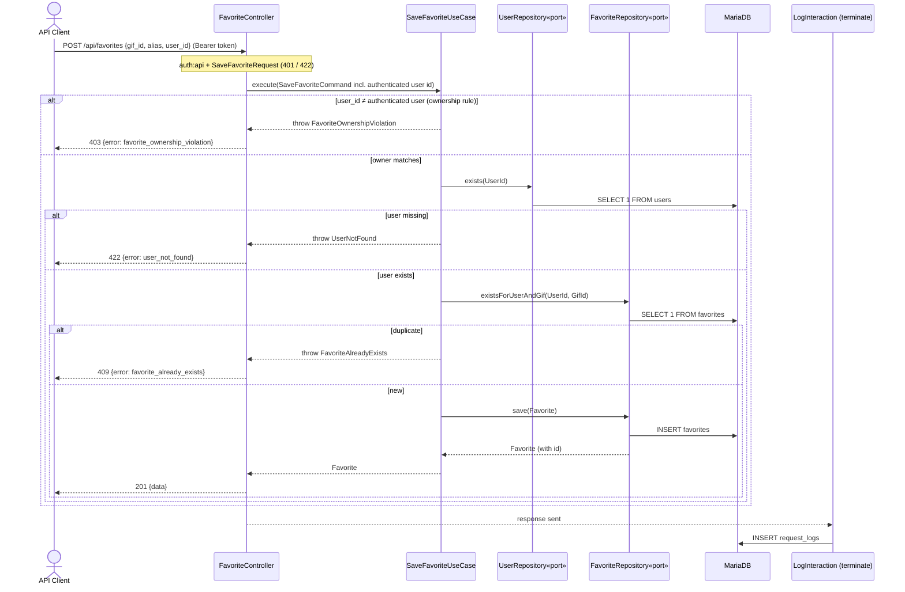
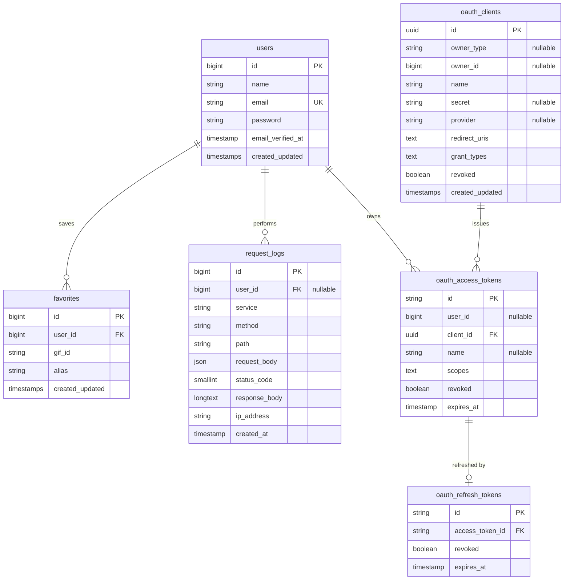

# Diagrams

All diagrams below are written in [Mermaid](https://mermaid.js.org/) and render
automatically on GitHub. The equivalent formal **UML (PlantUML)** sources live in
[`docs/uml/`](uml/) for anyone who prefers to render them with a UML tool.

---

## 1. Use Case Diagram

- **Login** is public; it exchanges e-mail/password for a 30-minute OAuth2 token.
- **Search GIFs**, **Get GIF by ID** and **Save Favorite GIF** require a valid token
  (`«include» Authenticate`).
- Every service `«include»`s **Persist Interaction Log** (the audit requirement).
- Search / Get query the external **GIPHY API**.

---

## 2. Sequence Diagrams

### 2.1 Login

### 2.2 Search GIFs

### 2.3 Get GIF by ID

### 2.4 Save Favorite GIF

> The ownership rule (a token holder may only save favorites for their own
> account) lives in `SaveFavoriteUseCase`, so it applies to any adapter that
> invokes the use case — not just the HTTP controller.

---

## 3. Entity–Relationship Diagram (DER)

> `favorites` has a **unique constraint on `(user_id, gif_id)`** enforcing that a
> user cannot save the same GIF twice. `request_logs` is the audit trail that
> stores, for every request: the user, the service, the request body (with
> secrets redacted), the HTTP status, the response body and the origin IP.
> Passport also creates `oauth_auth_codes` and `oauth_device_codes` (omitted here
> for clarity as they are unused by this API).
